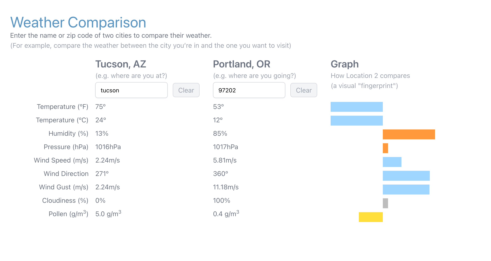
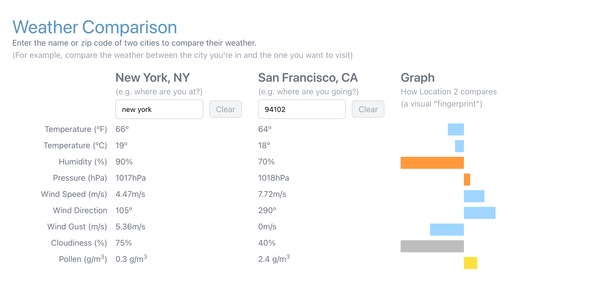
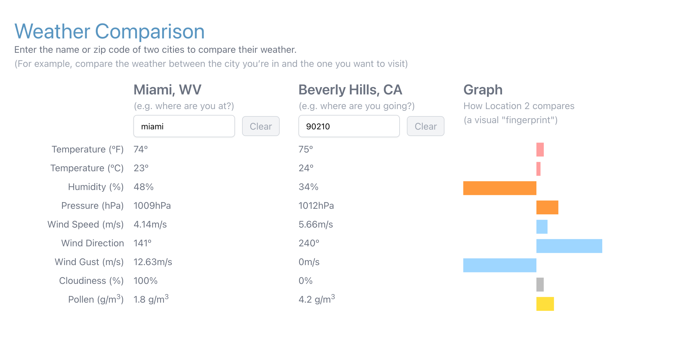
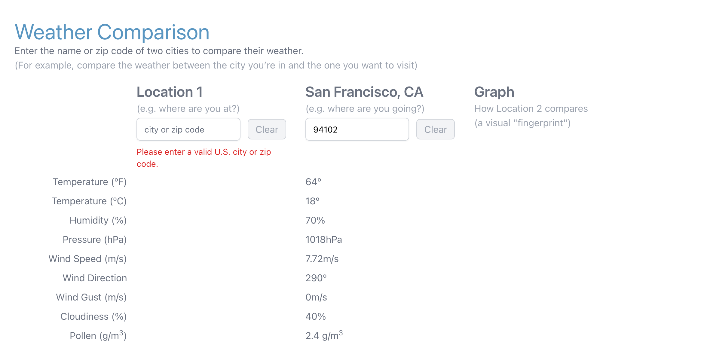
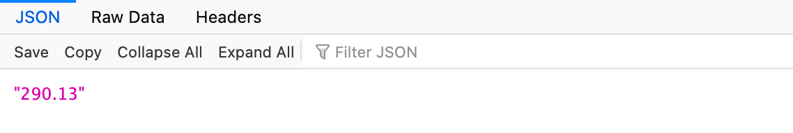

# Weather Comparison App
A simple web app that uses an API, consumes a microservice, and provides a microservice. 

Enter two U.S. locations (zip or city) to retrieve weather data from two sources (OpenWeather.org API and a pollen count microservice). A colored graph will provide a visual comparison of the data.

### Website
https://cs361-weather-app.herokuapp.com

### Microservice
Also provides a stock price API endpoint as a microservice. 

For example, a request to https://cs361-weather-app.herokuapp.com/api/stocks/NFLX, will trigger the API server to scrape the Yahoo Finance website for the current Netflix stock price and return that price as text in the response. This endpoint was recently updated as of 11/12/22, however, since Yahoo is able to change its website from time to time, this web scraping functionality may break.

### Tech Stack
Uses React, Tailwind CSS, and Flask. Hosted on Heroku. 

### Additional Screen Shots

**Microservice** - “NFLX” stock price fetched and provided at /api/stocks/NFLX

